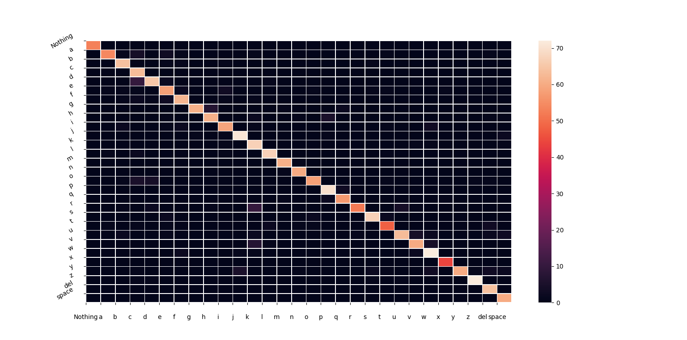

# Sign Alphabet Detection
Classify the images containing alphabets in sign languages. Using TensorFlow and Tkinter provides a clean `GUI` to the user.

## Dataset
1. Dataset used initially is available [here](https://www.kaggle.com/datasets/grassknoted/asl-alphabet)
* `Train accuracy`: 95%, `Test accuracy`: 93%
* Achieved poor performance in a live environment by a model trained on the above dataset because of image quality of train and live data, live images were of significantly lower quality.
2. Custom dataset is generated using [dataset_generater_tool.py](dataset_generater_tool.py) to reduce bias of train dataset.
* `Train accuracy`: 96%, `Test accuracy`: 93%
* Significantly higher live performance.

## Heatmap for Different Classes

