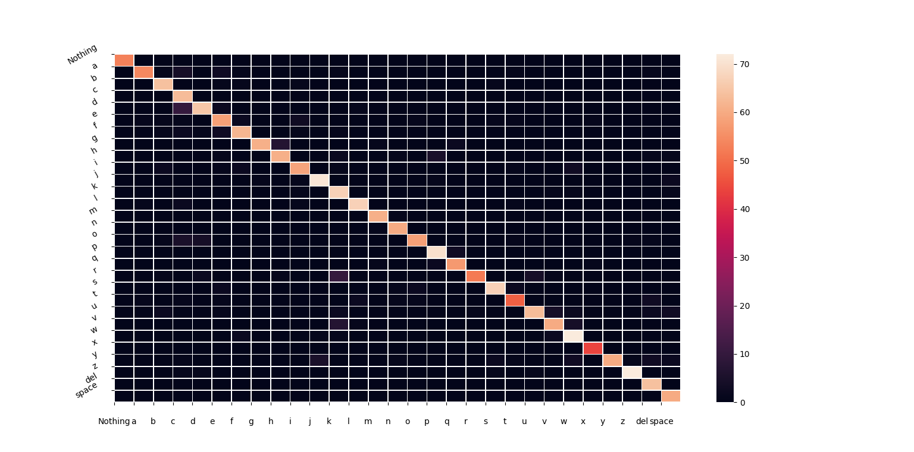

# Sign Alphabet Detection

This project aims to classify images containing alphabets in sign languages using TensorFlow. The application features a user-friendly GUI built with Tkinter.

## Dataset & Performance

1. **Original Dataset:** The initial dataset used is available [here](https://www.kaggle.com/datasets/grassknoted/asl-alphabet).
   - *Train Accuracy:* 95%
   - *Test Accuracy:* 93%
   - However, the model's performance in a live environment was suboptimal due to differences in image quality between the training and live data. Live images were notably of lower quality.

2. **Custom Dataset:** To address the bias in the original dataset, a custom dataset was generated using the [dataset_generater_tool.py](dataset_generater_tool.py).
   - *Train Accuracy:* 96%
   - *Test Accuracy:* 93%
   - Notably, this model exhibited significantly improved performance in live scenarios.

## Heatmap for Different Classes

